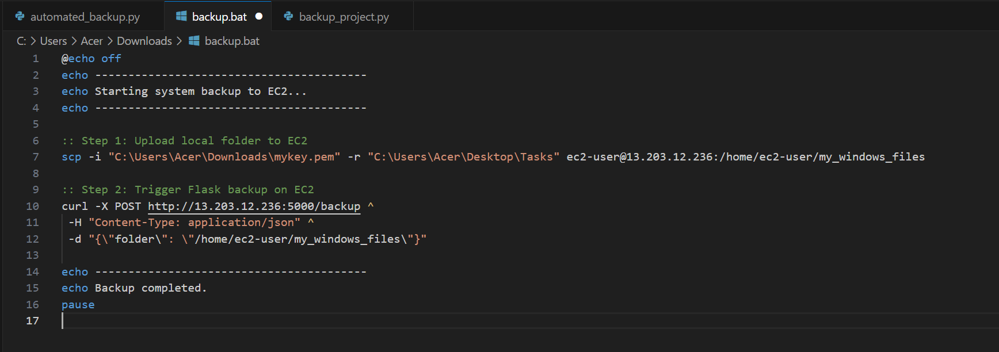
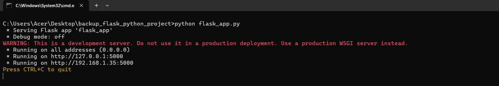
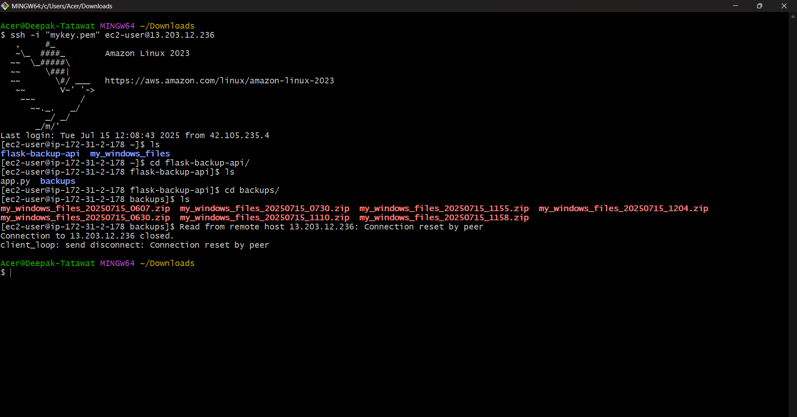
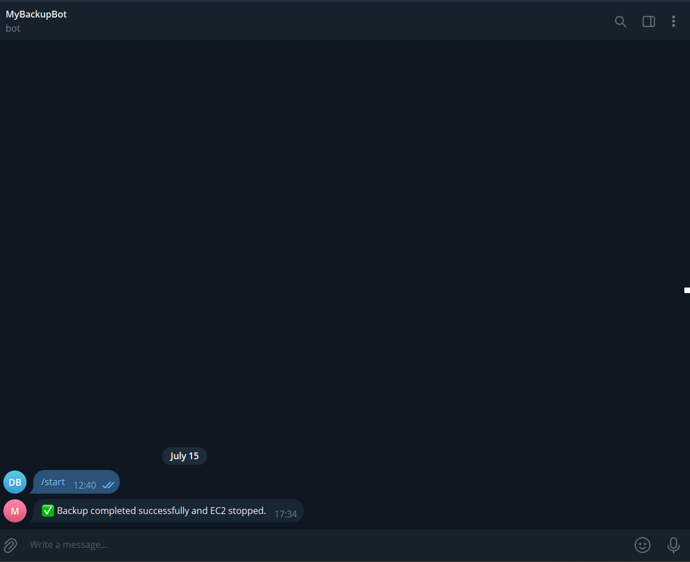
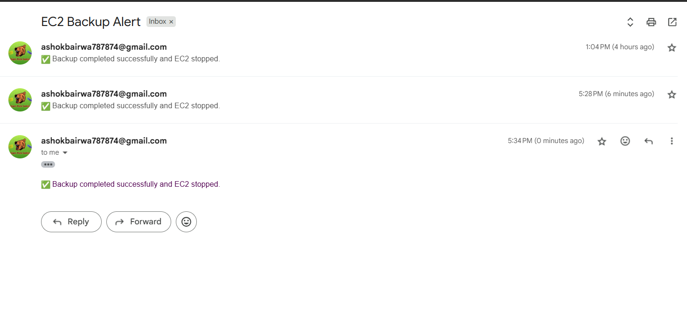

# 🛡️ EC2 Backup Automation with Python, Flask, and systemd

This project automates the backup of a Windows folder to an AWS EC2 instance using:

- ✅ Python & Boto3 for EC2 lifecycle control (start → backup → stop)
- ✅ Flask API on EC2 to zip and store uploaded folders
- ✅ Batch script from Windows to upload files and trigger API
- ✅ Telegram & Gmail alerts for backup status
- ✅ systemd service to persist Flask across reboots
- ✅ Elastic IP to avoid public IP changes

---

## 📌 Features

- One-click `.bat` file triggers secure remote backup
- Compresses folder remotely and saves zipped archive on EC2
- Automatically starts and stops EC2 instance to save cost
- Logs each step with timestamps
- Real-time alerts via Telegram and Email
- Tested on Amazon Linux 2 with Elastic IP

---

## 🛠️ Setup

### EC2 Preparation
```bash
sudo yum install python3 -y
pip3 install flask boto3
scp -i <your-key.pem> -r flask-backup-api ec2-user@<Elastic-IP>:~/flask-backup-api
```

### Run Flask API as systemd Service
```ini
# /etc/systemd/system/backup-api.service
[Unit]
Description=Flask Backup API
After=network.target

[Service]
User=ec2-user
WorkingDirectory=/home/ec2-user/flask-backup-api
ExecStart=/usr/bin/python3 app.py
Restart=always

[Install]
WantedBy=multi-user.target
```
```bash
sudo systemctl enable backup-api
sudo systemctl start backup-api
```

### Windows Trigger Script (.bat)
```bat
@echo off
echo Starting system backup to EC2...

scp -i "<your-key.pem>" -r "C:\Path\To\Folder" ec2-user@<Elastic-IP>:/home/ec2-user/my_windows_files

curl -X POST http://<Elastic-IP>:5000/backup ^
 -H "Content-Type: application/json" ^
 -d "{\"folder\": \"/home/ec2-user/my_windows_files\"}"

echo Backup completed.
pause
```

---

## 🧠 Python Automation Script

- Starts EC2 instance via Boto3
- Waits for initialization
- Triggers batch script locally
- Sends Telegram + Email alerts
- Stops EC2 and logs the workflow

See `automated_backup.py` for full implementation.

---

## 🔔 Notifications

- Telegram via bot token + chat ID (set in environment)
- Email via Gmail SMTP (app password)
- Both are configurable inside the Python script

---

## 🧪 Tested Workflow

- ✅ Local to EC2 file upload using SCP
- ✅ Flask API triggered remotely
- ✅ Backup zipped and stored in EC2 folder
- ✅ Real-time alerts received
- ✅ EC2 instance shutdown automatically

---

## 📸 Screenshots

### 🔹 1. Batch Script Executing


### 🔹 2. Flask API Running on EC2


### 🔹 3. Zip File Created Remotely


### 🔹 4. Telegram Notification


### 🔹 5. Email Notification


---

## 🎥 Demo Videos

▶️ [Complete Automation Demo](screenshots/complete_automation.mp4)  
▶️ [Automated Python Script](screenshots/automated_backup_script.mp4)  
▶️ [Batch Script Trigger](screenshots/batch_executing.mp4)

---

## 🧩 Repository Structure

```
ec2-backup-automation/
├── app.py                   # Flask API for EC2
├── automated_backup.py      # Python script for automation
├── backup_to_ec2.bat        # Batch file to trigger upload + API
├── backup-api.service       # systemd unit file for Flask API
├── backup_log.txt           # Sample output logs
├── screenshots/             # Demo screenshots and videos
└── README.md                # Full documentation
```

---

## 📄 License

MIT — Free to use, modify and share.
